# Repository for Semantic Segmentation using Deep Learning for [MoNuSeg](https://monuseg.grand-challenge.org/Data/) Dataset

In this repository, we work with already created ground truth segmentation masks.

# What is Segmentation Segmentation?
The goal of semantic image segmentation is to label each pixel of an image with a corresponding class of what is being represented.
Because we’re predicting for every pixel in the image, this task is commonly referred to as dense prediction. The major applications of semantic segmentation
are bio-medical diagnosis, Geo-Sensing, automous vehicles etc.

# Diagrams

## UNet
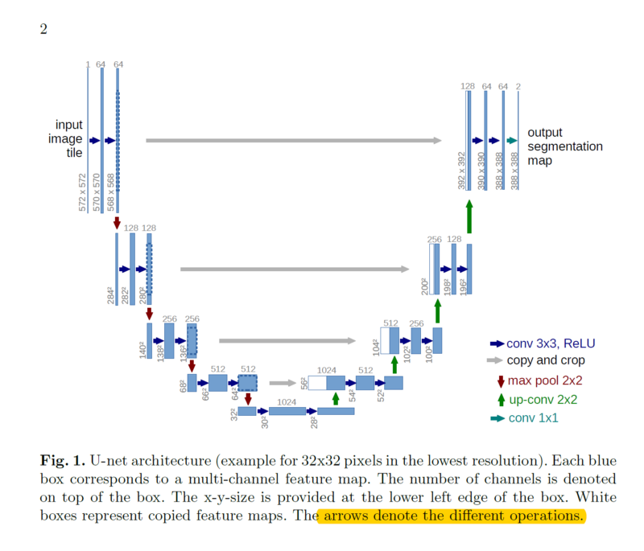
## SegNet
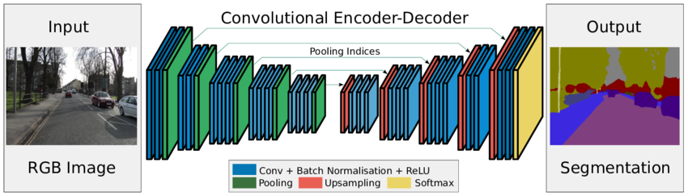
## DeepLabv3
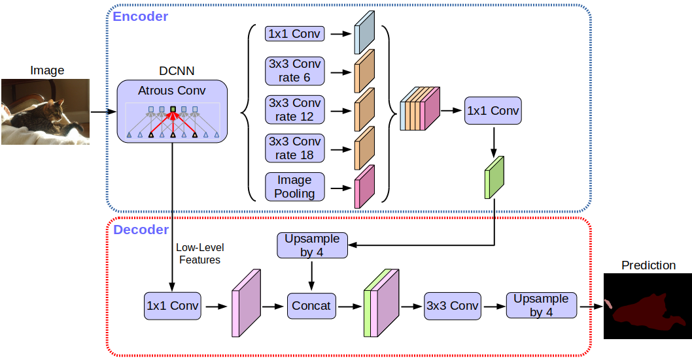

# Our Network Summaries
## UNet
Refer to the notebook
## SegNet
Refer to the respective notebook
## DeepLabv3
Refer  to the respective notebook

# Pre-processing
MonuSeg datset contains 30 images for training and 14 images for testing each size of 1000x1000. 
To facilitate the training process, patches i.e. 256x256 for every images along with their corresponding masks can be generated using
`view_as_windows`. More details can be found in `patch_generator.ipinb`. Each image in the example generates 36 patches, thus overall 1584 patches.

# Pre-requistes
Main packages required are:
 - Keras 2.2.3
 - Tensorflow 1.15.0
 - Numpy
 
 
More details can be found in respective notebooks.

# Features
Can be found in respective notebooks
 - [x] Preprocessing
 - [x] Data set Visualizations
 - [x] Networks summaries
 - [x] Training
 - [x] Inference
 - [x] Predicted result visualized
 

# Models

This repository contains three different semantic segmentation models:
 - UNet (Training + inference)
 - SegNet (Training + inference)
	- supports indices pooling)
 - DeepLabv3 (Training + inference)
	- supports MobileNetv2 and Xception backbone

You can find trained models in respective folders.

# Performance Graphs

## UNet
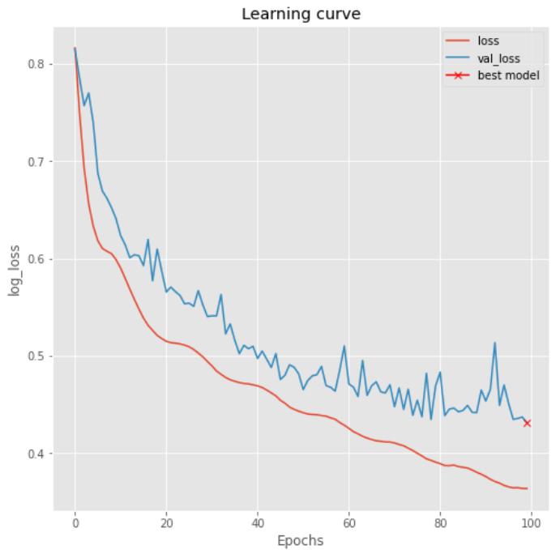
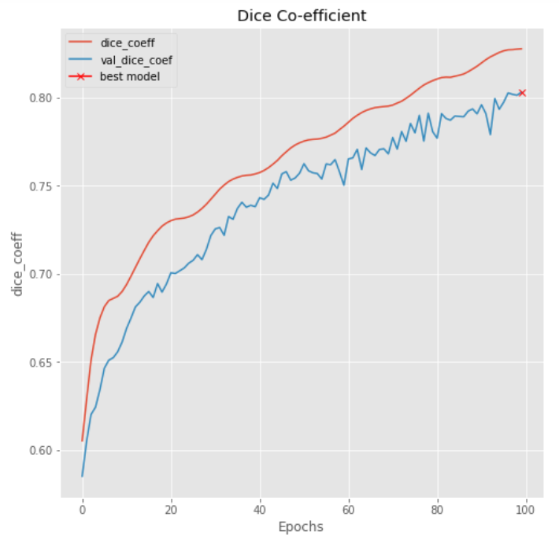

## SegNet
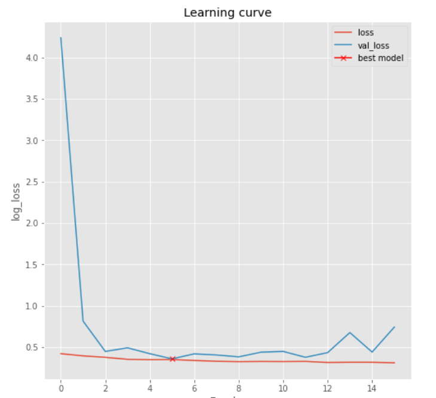
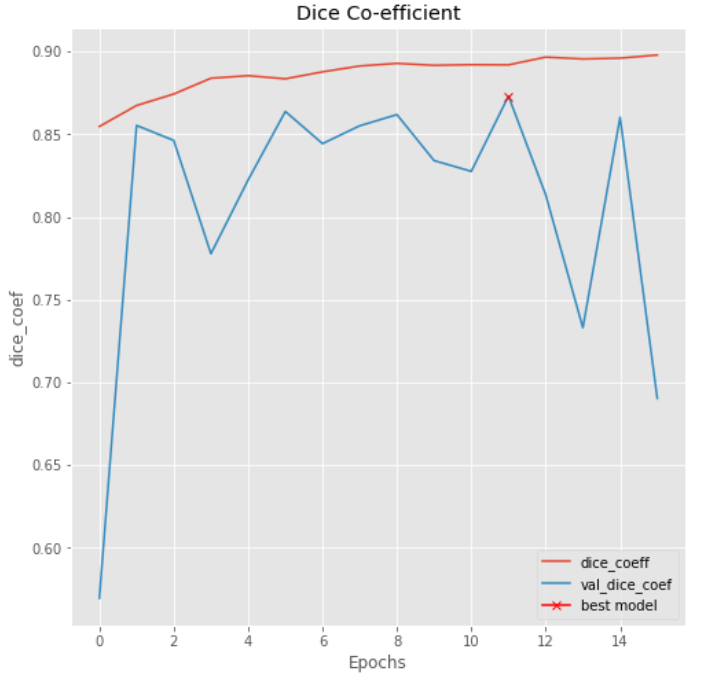

## DeepLabv3
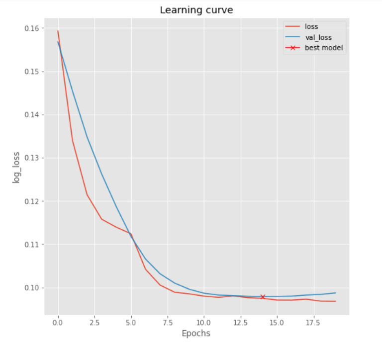
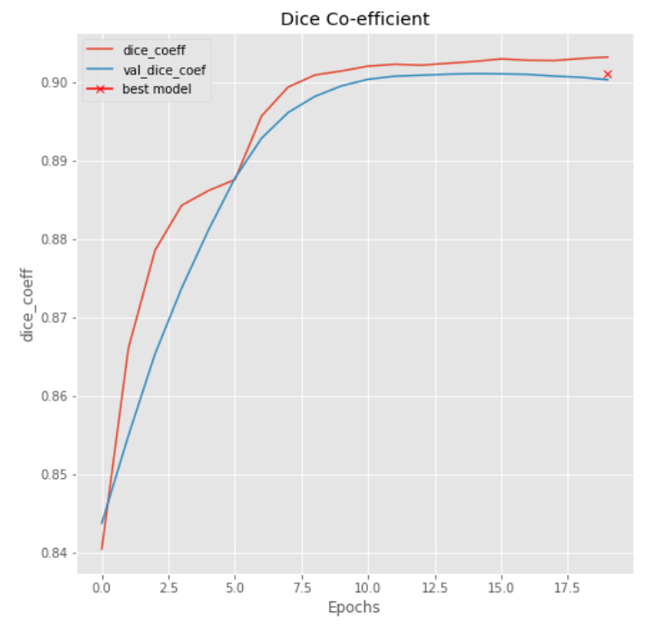

# Quantitative Results
# UNet
Results | Values
------------ | -------------
Test Loss | 0.42978010276706874
Test Accuracy | 0.8665722351216205
Dice co-efficient |0.8034556142745479
F1-score | 0.7157416380664551

# SegNet
Results | Values
------------ | -------------
Test Loss| 0.3588969517837871
Test Accuracy| 0.8288334337147799
Dice co-efficient | 0.8644718094305559
F1-score| 0.6526657884771173

# DeepLabv3
Results | Values
------------ | -------------
Dice Loss | 0.0832267701625824
Dice co-efficient | 0.9167312383651733
Accuracy | 0.7988329529762268

# Some Predicted Results
## UNet
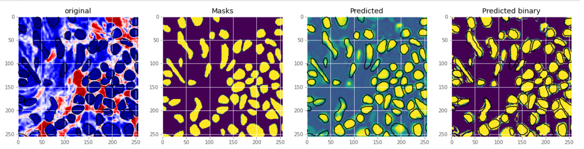

## SegNet
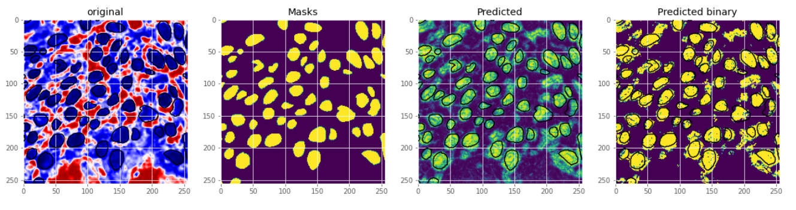

## DeepLabv3
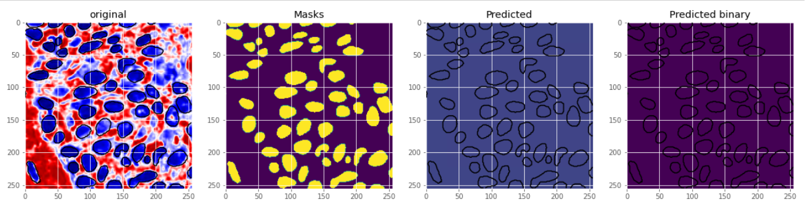

